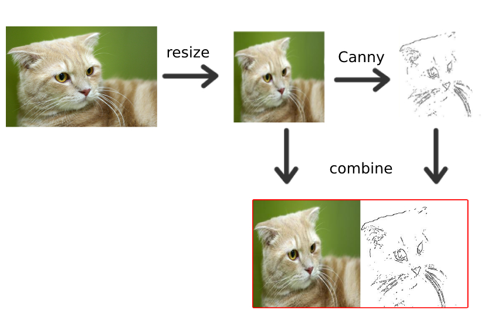

# pix2pix (Edge2Cat)

[Origin](https://github.com/junyanz/pytorch-CycleGAN-and-pix2pix)

## About

pix2pix использует условную порождающую состязательную сеть (cGAN) для сопоставления входного изображения с изображением на выходе.

- Генератор с архитектурой U-Net.
- Дискриминатор, представленный сверточным классификатором PatchGAN (предложенный в статье [pix2pix](https://arxiv.org/abs/1611.07004)).

## Dataset

Обучен примерно на 5к фотографиях котеек из датасета [Cat Dataset](https://www.kaggle.com/crawford/cat-dataset) и сгенерированных контуров с помощью оператора Кэнни (Canny Edge Detection).

[Download dataset](https://drive.google.com/file/d/10A-NMbBoZQP6TKDdQLdkxKBVCFhPf7s6/view?usp=sharing)

## Pretrained model

[Download pretrained model](https://drive.google.com/file/d/1Qf-QRRaWplKe1zOSlG5OMMJ6NxHFp-F6/view?usp=sharing)